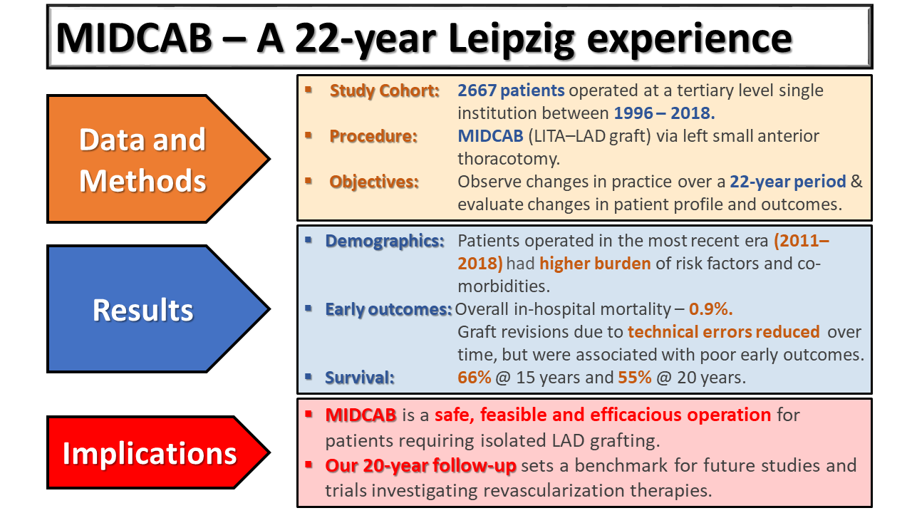

```{r, include = FALSE}
knitr::opts_chunk$set(
  collapse = TRUE,
  comment = "#>"
  
)

library(badger)
```

# Twenty-year outcomes of minimally invasive direct coronary artery bypass surgery:
## The Leipzig experience.

*Piroze M. Davierwala MD^1^, Alexander Verevkin MD^1^, Laura Bergien MD^1^, Konstantin von Aspern MD^1^, Salil V. Deo MD^2^, Martin Misfeld MD PhD^1^, David Holzhey MD PhD^1^, Michael A. Borger MD PhD^1^*


1 - Leipzig Heart Center, University Department for Cardiac Surgery, Leipzig, Germany
2 - North East Ohio VA Healthcare System, Louis Stokes Cleveland VA Medical Center,
Department of Veterans Affairs, Cleveland Ohio, United States of America

`r badge_custom("Leipzig Heart Center","CV Surgery","blue")`


### This manuscript is an AATS (Virtual 2020) meeting presentation.

#### Address for correspondence:

Dr. Piroze M. Davierwala

University department for Cardiac Surgery

Leipzig Heart Center,

Struempellstraße 39, 04289 Leipzig, Germany

Tel.: +49 / 341 / 865 251049 Fax: +49 / 341 / 865 1452

E-mail: pirarm@hotmail.com


