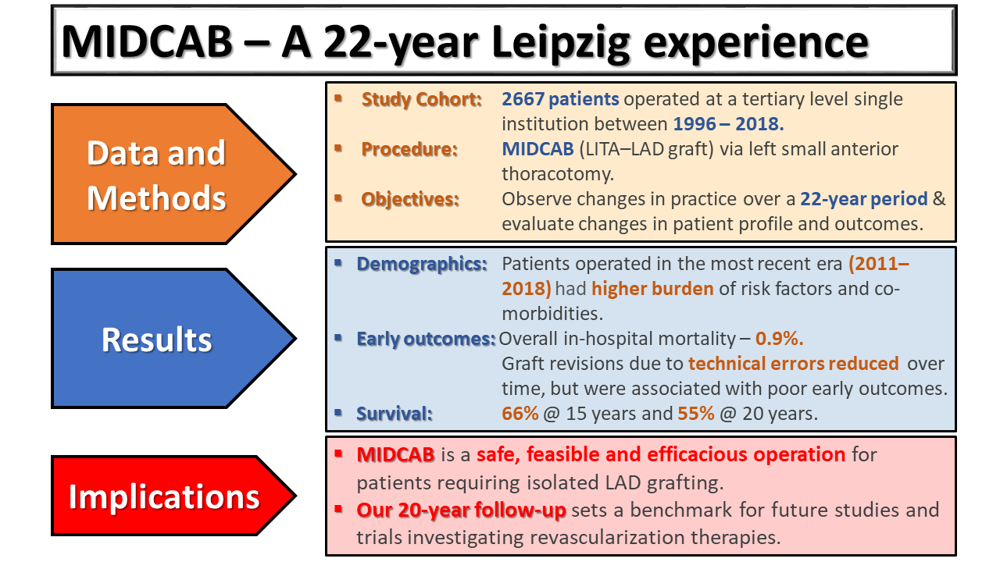

# Twenty-year outcomes of minimally invasive direct coronary artery bypass surgery:

## The Leipzig experience.

*Piroze M. Davierwala MD1, Alexander Verevkin MD1,
Laura Bergien MD1, Konstantin von Aspern MD1,
Salil V. Deo MD2, Martin Misfeld MD PhD1, David
Holzhey MD PhD1, Michael A. Borger MD PhD1*

1 - Leipzig Heart Center, University Department for Cardiac Surgery,
Leipzig, Germany 2 - North East Ohio VA Healthcare System, Louis Stokes
Cleveland VA Medical Center, Department of Veterans Affairs, Cleveland
Ohio, United States of America

### This manuscript is an AATS (Virtual 2020) meeting presentation.

#### Address for correspondence:

Dr. Piroze M. Davierwala

University department for Cardiac Surgery

Leipzig Heart Center,

Struempellstraße 39, 04289 Leipzig, Germany

Tel.: +49 / 341 / 865 251049 Fax: +49 / 341 / 865 1452

E-mail: <pirarm@hotmail.com>

